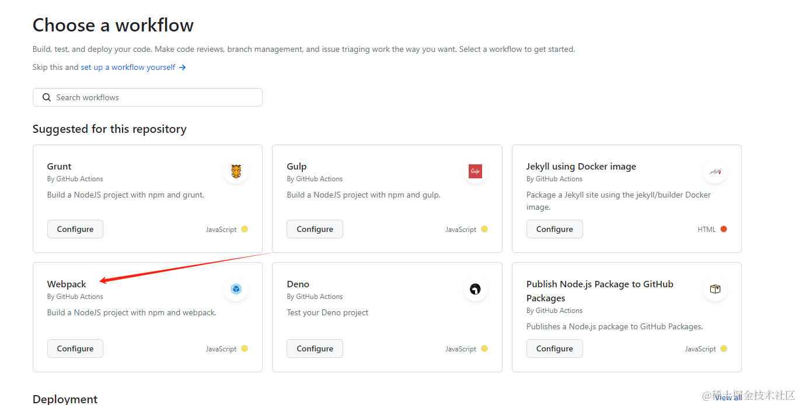
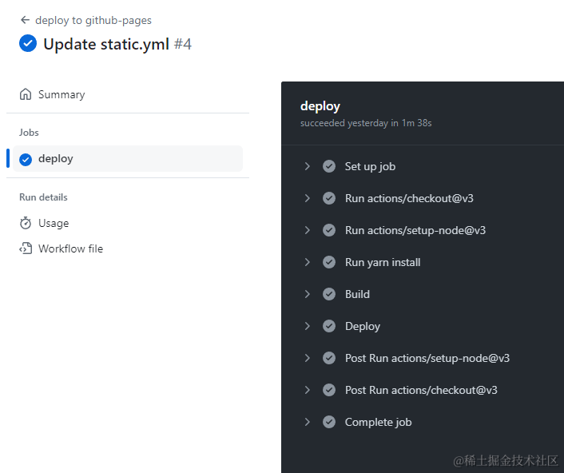

---
nav:
  title: 文章
  path: /blog
toc: content
order: 1
category: Components
title: 通过 gitHub Action 自动发布博客
group:
  title: 2024年
  order: 1
---

## 背景

因为之前的博客升级了，并且 gh-pages deploy 的命令好像也失效了，不知道是不是这个包已经被废弃了，折腾了一段时间发现，没什么卵用，导致每次博客推送都得自己手动打包发布。

我是个极其嫌麻烦的人，这样下去，会给我高效的生活带来苦恼，所以就只好另寻方案。

之前一直了解有 github action 是个好东西，有点像我之前用的 travis-ci，所以正巧有时间，就试试看学习了解一下这玩意儿。

## 实操过程

### 第一步：在项目中新增配置文件

在 git 仓库的根目录下，创建一个文件夹 .github, 在该文件夹下再创建一个文件夹 workflows, 在这个文件夹下创建一个文件，以 .yml 结尾，名字可以自己自定义，比如我的比较简单，就叫 **static.yml**

### 第二步：配置 .yml 文件

我们先进到 [actions 模板页面](https://github.com/actions)，里面有很多的模板供你选择，你可以选一个适合自己的，当然你也完全靠自己写 [actions 学习教程](https://docs.github.com/en/actions/learn-github-actions)



我懒人一个，所以就直接找现成的模板去使用了，我参考了两个模板，一个是 webpack 模板，一个是 html 静态页面推送模板。总结两个模板的内容后，合并的相关配置如下（其实并无大关联）：

```javascript
name: deploy to github-pages

on:
  push:
    branches: ['main']
  pull_request:
    branches: ['main']

jobs:
  deploy:
    runs-on: ubuntu-latest
    steps:
      - uses: actions/checkout@v3
      - uses: actions/setup-node@v3
        with:
          node-version: 20
      - run: yarn install
      - name: Build
        run: yarn build

      - name: Deploy
        uses: peaceiris/actions-gh-pages@v3
        with:
          github_token: ${{ secrets.ACTION_SECRET }}
          publish_dir: ./docs-dist
```

解释一下这几个参数：

#### 1. name

就是这个模板的名称，会在 github 的 action 面板显示

#### 2. on

- push.branches: 监听的触发分支，可以设置一个，也可以设置多个分支（传数组就行）
- pull_request: 拉取的时候触发

#### 3. jobs

和名字的意思一样，工作流水线，我们可以拼接很多的配置来控制这条链路,我们拿上文的案例来说明：

- **deploy：** 工作的单个 job 名称，我们可以配置很多个，简单理解就是多个 job 对应这个整体的 jobs

- **runs-on：** 当前 actions 运行的工作环境，这里设置的是 ubuntu

- **steps：** 当前 job 的运行步骤，依次执行
-
- **steps.name：** 下一步骤的名称，可以随意命名

- **steps.uses:** 声明使用到的镜像文件，比如本文用到了几个镜像文件：actions/checkout@v3、 actions/setup-node@v3、peaceiris/actions-gh-pages@v3

其中 actions/setup-node@v3 用来安装 node 环境，peaceiris/actions-gh-pages@v3 用来部署 gh-pages.

- **steps.with：** 需要用到镜像里的什么东西，或者传递的参数,这里针对不同的镜像，传递的参数也不同，比如：peaceiris/actions-gh-pages@v3，这个镜像，里面需要的是两个参数，一个是 github_token，一个是需要上传的文件或者文件夹 publish_dir

- **steps.run：** 执行的脚本命令

最终到 github 的界面会以这样的刑事展示出来，如下图：



> 更多参数介绍可以去看[官方文档](https://docs.github.com/en/actions/learn-github-actions)，我这里因为就用了这么几个，就不一一展开了

## 链接

[个人博客](https://j710328466.github.io/)

[nicecode](https://nicecoders.github.io/)
