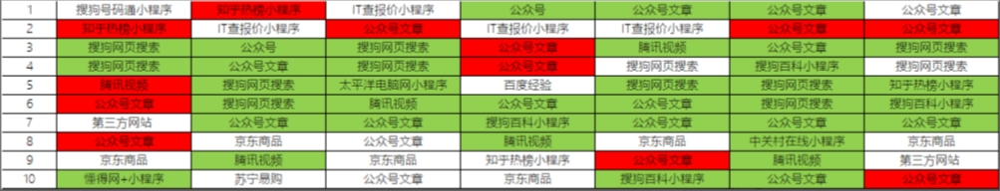

---
nav:
  title: 文章
  path: /blog
toc: content
category: Components
title: 如何优化在微信搜一搜的 SEO
group:
  title: 2024年
---

## 什么是 SEO

我们经常会用到一些搜索引擎，baidu、google、bing...

它们出来的搜索结果，会有一定的排列顺序。按照每个搜索引擎的算法标准都会有不同的收录排列标准。

SEO 就是优化这个权重，让网站排名尽量靠前的一种技术手段。

## 什么又是微信 SEO？

随着时代的进步，很多人已经习惯不使用搜索引擎，转而使用一些其它的方式搜索想要的内容，比如微信的搜一搜，哪里有需求，哪里就有相关的服务与技术手段。

它也是从不同的收录权重去分析，微信是怎么展示这个搜索结果排名的。以下是微信搜一搜结果的参考来源：

