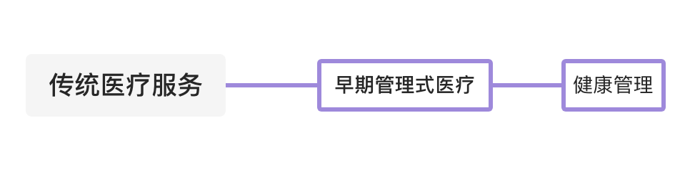
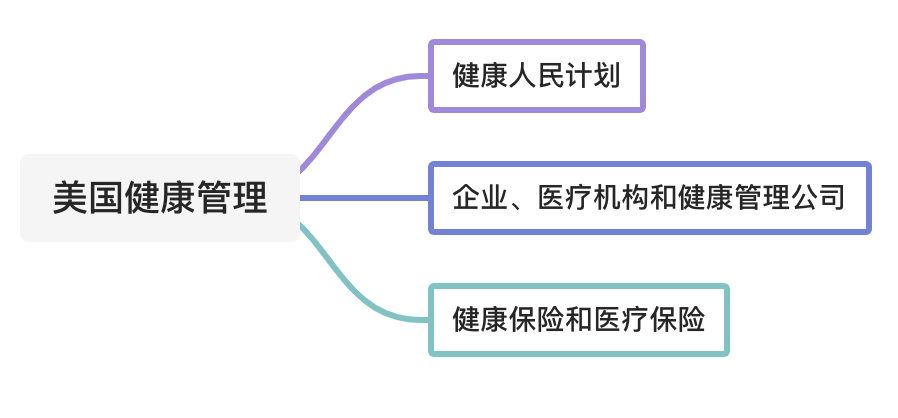
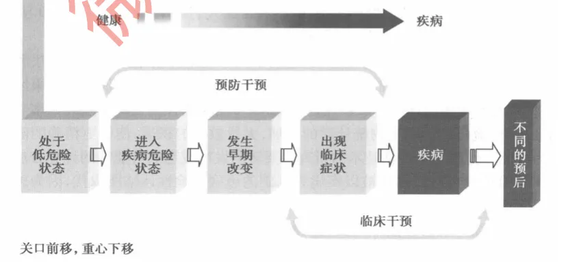
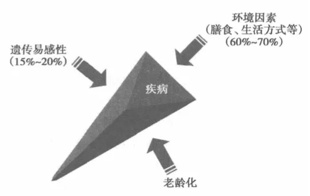
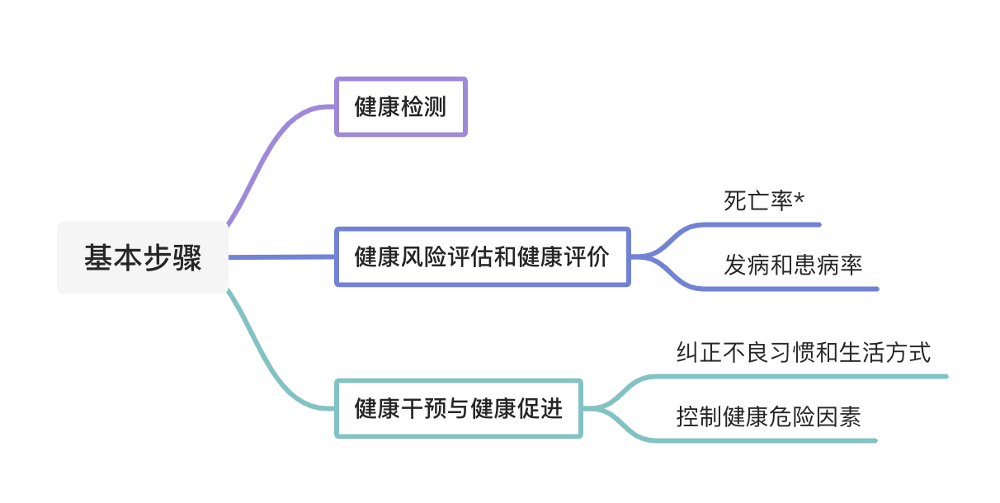
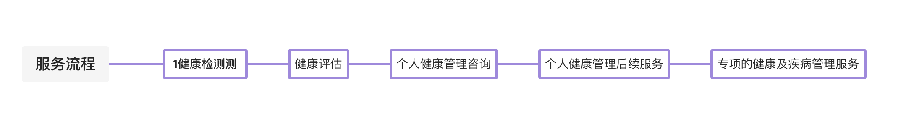
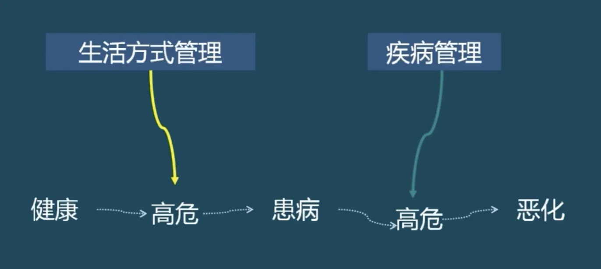
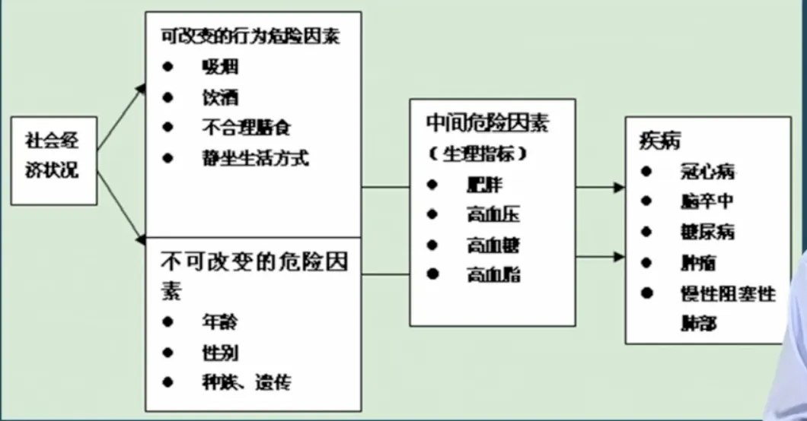

---
nav:
  title: 健康管理
  path: /healthy
  order: 8
toc: content
title: 1. 健康管理概论
description: 健康管理师课程笔记
keywords: [健康管理师, 健康管理]
group:
  title: 健康管理师
  order: 1
---

## 第一节 概述

### 1、健康管理的定义和特点

定义：健康管理是在控制健康风险这个需求的基础上对健康资源进行计划、组织、指挥、协调和控制的过程，也就是对个体和群体健康进行全面监测、分析、评估、提供健康咨询和指导对健康危险行为精心干预的过程

**健康管理服务特点：标准化、量化、个体化和系统化**

传统诊治模式：生物 - 医学模式
社会支持的健康为中心的管理模式：生物 - 心理 - 社会模式

健康管理中 **管理的概念**：

> 包括制订战略计划和目标、管理资源、使用完成任务所需要的人力和财务资本以及衡量结果的组织过程。其目的是节约资源，节省时间，充分利用、发挥现有设备技术的作用和人的积极性，**帮助用户以最小的投入获取最大的收益**

#### 健康管理的目标

1. 完善健康和福利
2. 减少健康危险因素
3. 预防疾病高危人群患病
4. 易化疾病早期诊断
5. 增加临床效用效率
6. 避免可预防的疾病相关并发症的发病
7. 消除或减少无效或不必要的医疗服务
8. 对疾病结局做出度量并提供持续的评估和改进

#### 大事记

1. 1948 年：世界卫生组织宪章中首次提出三维健康概念：

   - '健康不仅仅是没有疾病和虚弱，而是一种身体，心理和社会的完好状态'

2. 1978 年：WHO 通过《阿拉图木宣言》重申健康概念的内涵：

   - 健康不仅仅是没有疾病和痛苦，而是包括身体，心理和社会功能各方面完好的状态

3. 《渥太华宪章》健康概念表述为：

   - 良好的健康是社会、经济和个人发展的重要资源

4. 1984 年：《保健大宪章》中将健康概念表述为：

   - 健康不仅仅是没有疾病和虚弱，而是包括身体、心理和社会适应能力的完好状态

5. 1989 年：WHO 指出健康应该是：
   - 生理、心理、社会适应和道德方面的良好状态

### 2、健康管理的理论与时间溯源

健康管理的**指导思想**：治未病

> 出自《黄帝内经》：圣人不治已病治未病，不治已乱治未乱，此之谓也。
> 魏文王问扁鹊，他如是说：上工治未病、中工治欲病、下工治已病

#### 保健体系的发展阶段

### 3、健康管理在美国的应用

### 4、健康管理的科学基础

#### 疾病的发生、发展过程及干预策略

其中处于【进入疾病危险状态】、【发生早期改变】、【出现临床症状】 阶段都能够进行预防干预
【出现临床症状】、【疾病】阶段能进行临床干预

#### 慢性病的相关危险因素

通过下图，可以看到，慢性病的发病因素，60-70%的概率来自于【膳食与生活方式】

### 5、健康管理的基本步骤

### 6、健康管理的服务流程

### 7、提供健康管理服务的机构

## 第三节 健康管理的基本策略

通过健康评估和控制健康风险，达到维护健康的目的。

### 健康管理步骤

#### 第一步：信息采集

#### 第二步：健康风险评估

主要作用：

1. 帮助个体综合认识健康因素
2. 鼓励和帮助人们修正不健康的行为
3. 制定个体化健康干预措施
4. 评价干预措施的有效性
5. 对人群进行分层管理，筛选高危人群，进行分层管理
6. 其它，如在健康保险行业的核保等

健康危险因素（使人群发病和死亡风险升高），常见慢性病及其共同危险因素之间的内在关系见下图：

#### 第三步：健康干预

主要干预方式：膳食指导、运动干预、心理疏导、戒烟限酒

#### 第四步：干预效果评估

评估层面：

1. 健康知识信念
2. 生活习惯、行为
3. 生理指标
4. 未来患病、死亡危险性

### 健康管理与相关学科关系

大预防医学概念：三级预防
健康教育
流行病学

### 健康管理服务流程

1. 问卷调查&健康体检
2. 健康评估
3. 个人健康管理咨询
4. 个人健康管理后续服务
5. 专项的健康及疾病管理服务

### 提供健康管理服务的机构

1. 健康保险公司、健康管理公司
2. 医院保健和健康管理部门
3. 医院和民营健康体检机构
4. 社区医疗卫生服务机构
5. 机关单位、企业、部队、学校医务室

### 健康管理行业面临的问题

1. 可持续的商业模式
2. 有效的健康干预管理方法、工具、技术
   - 目的是治未病，不要等到后面问题出现了，才去注意到这些问题
3. 科学研究、学科建设
4. 政策研究：健康产业
