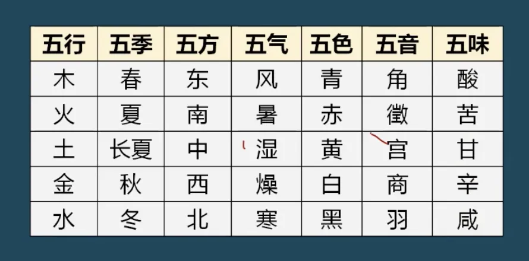
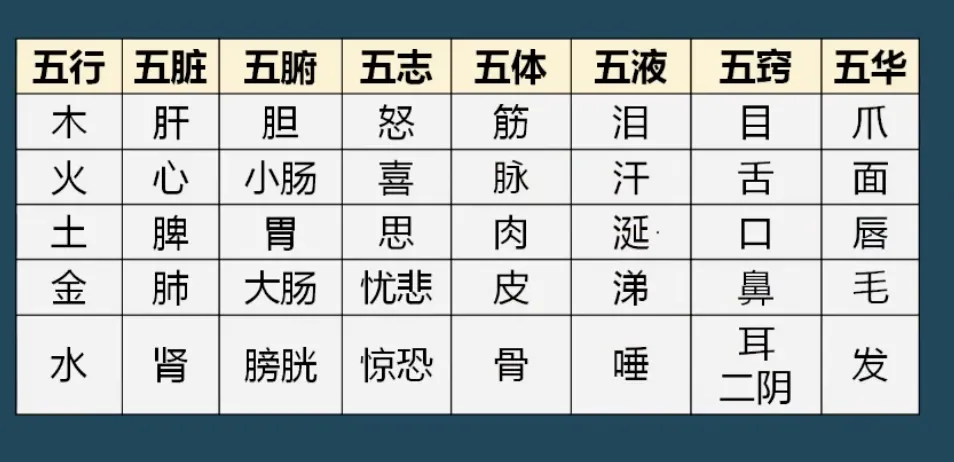
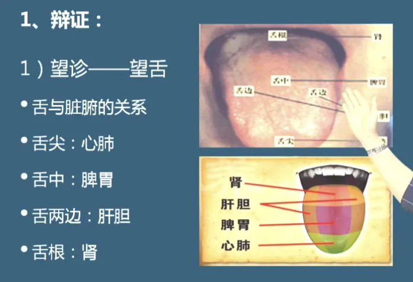
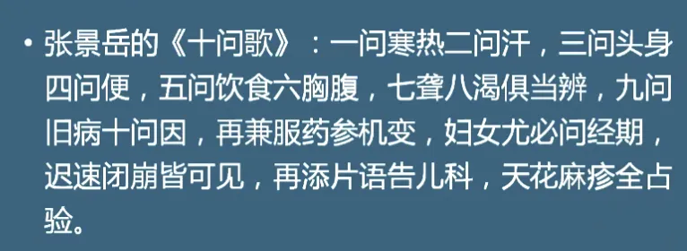

---
nav:
  title: 健康管理
  path: /healthy
  order: 8
toc: content
title: 10 - 中医养生
order: 10
description: 健康管理师课程笔记
keywords: [健康管理师, 健康管理]
group:
  title: 健康管理师
  order: 1
---

## 什么是中医

道为规律，术为方法，道术即为中医的起源。

## 医学四大名著

1. 黄帝内经
2. 黄帝八十一难经
3. 伤寒杂病论
4. 神农百草经

## 中医基础理论

### 一、阴阳学说

阴阳的概念：宇宙中相互关联的事物或相互对立属性的概念

### 二、五行学说

1. 事物五行归属（自然）

2. 事物五行归属（人体）

### 五、气血精津

#### 4. 精的分类和作用

- 先天之精：维持人体生长发育和生殖作用
- 后天之精：维持脏腑正常生理功能

#### 5. 津液的作用

### 六、发病与病因

发病是指导致疾病发生的原因，又称致病因素

#### 病因分类

外因：六淫（风、寒、暑、湿、燥、火，即六大外感病邪）

### 七、辨证论治

#### 1. 辩证（治疗的前提和基础）

根据四诊收集资料，通过分析、综合、辩清疾病病因、以及邪正之间的关系，概括、判断为某种性质的证。

> 四诊：望、闻、问、切

##### ① 望诊

正常人的面色： 红黄隐隐，明润含蓄

1. 面
   - 面赤：虚热、实热、血瘀
   - 面青：寒、痛、淤血、惊风。
   - 面黄：主湿、脾虚
   - 面黑：主寒、痛、淤血、水饮，肾虚。
2. 舌头

正常舌头：淡红舌、薄白苔

- 

##### ② 闻诊

听声音、嗅气味

##### ③ 问诊

##### ④ 切诊（脉诊、按诊）

脉诊部位：寸口处（原理：肺朝百脉）
脉象分类：平脉、28 种病脉
切脉方法：举、按、寻

#### 2. 论治

治则：扶正驱邪、调整阴阳、治病求本
治疗手段：针灸、推拿、气功、食疗、导引、精神调摄等
