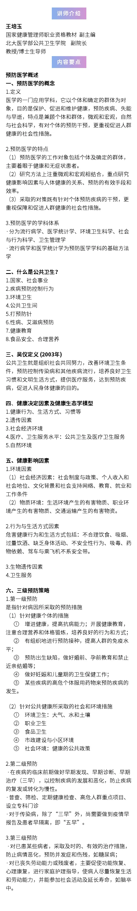
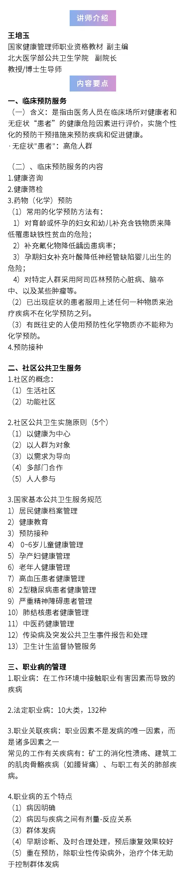

---
nav:
  title: 健康管理
  path: /healthy
  order: 8
toc: content
title: 3. 预防医学基础知识
description: 健康管理师课程笔记
keywords: [健康管理师, 健康管理]
group:
  title: 健康管理师
  order: 1
---

## 第一节：概述

### 什么是预防医学？

传统分类：

1. 基础医学
2. 临床医学
3. 预防医学（公共卫生）

是医学的一门应用学科，以个体和确定的群体为对象，目的是保护，促进和维护健康，预防疾病、失能与早逝，特点是兼顾个体和群体，微观和宏观，自然与社会科学，有对个体的预防干预，更重视促进人群健康的社会措施

#### 预防医学的学科体系-欧美（国标）

1. 流行病学【重要】
2. 生物统计学【重要】
3. 环境卫生、职业卫生【重要】
4. 社会与行为科学（健康教育、促进）
5. 卫生政策与管理

#### 预防医学的学科体系-中国

1. 流行病学、生物统计学【重要】
2. 社会医学与卫生事业管理【重要】
3. 环境卫生、职业卫生【重要】
4. 营养学与食品卫生学
5. 少儿卫生
6. 卫生毒理学

### 什么是公共卫生？

- 国家，社会事业
- 疾病预防控制行为

> 吴仪定义（2003）：公共卫生就是组织社会共同努力，改善环境卫生条件，预防控制传染病和其它流行疾病

### 它们之间的联系与区别？

- 预防医学是一门专门的学科

### 健康决定因素以及健康生态学模型

- 健康行为、生活方式、习惯等
- 遗传因素
- 社会经济环境
- 医疗、卫生服务水平：公共卫生以及医疗卫生服务
- 自然环境››

### 三级预防策略

#### 第一级预防

针对病因所采取的预防措施：

- 个体的措施
  - 增进健康，提高抗病能力；开展健康教育，注意合理营养和提个锻炼，培养良好的行为和方式
  - 有组织的进行预防接种，提高人群的免疫水平
  - 预防出生缺陷，做好婚前、孕前教育和禁止近亲结婚等
  - 做好妊娠和儿童期的卫生保健工作
  - 某些疾病的高危个体服用药物来预防疾病的发生，即化学预防
- 环境的措施
  - 环境卫生：大气、水和土壤
  - 职业卫生：...

#### 第二级预防

在疾病的临床前期做好早期发现、早期诊断、早期治疗（三早），以控制疾病的发展和恶化，繁殖疾病的复发或转化为慢性

#### 第三级预防

对已患某些病者，采取及时的，有效的治疗措施，防止病情恶化，预防并发症和伤残，如糖尿病；
对已丧失劳动能力或残废者，主要促使功能恢复、心理康复，进行家庭护理指导，使病人尽量恢复生活和劳动能力，并能参加社会活动及延长寿命：如脑卒中。

## 第二节：临床预防服务

是指由医务人员在临床场所对健康者和无症状“患者”的健康危险因素进行评估，实施个性化的预防干预措施来预防疾病和促进健康。（无症状“患者”：高危人群）

### 临床预防服务内容

1. 健康咨询
2. 健康筛检
3. 药物预防
4. 预防接种

## 第三节：社区公共卫生服务

### 社区的概念

生活社区，功能社区

### 社区公共卫生实施原则

1. 以健康为中心
2. 以人群为对象
3. 以需求为导向
4. 多部门合作
5. 人人参与

### 国家基本公共卫生服务规范 12 项

- 严重精神障碍患者管理
- 肺结核患者健康管理
- 中医药健康管理
- 传染病及突发公共卫生事件报告和处理
- 卫生计生监督协管

### 职业病管理

#### 职业病

在工作环境中接触职业有害因素导致的疾病

#### 法定职业病

总共有 10 大类，132 个病种，尘肺，中毒，物理因素，放射等

#### 职业关联疾病

职业因素不是发病的唯一因素，而是诸多因素之一

### 职业病的五个特点

- 病因明确
- 病因与疾病之间有剂量-反应关系
- 群体发病
- 早期治疗诊断效果好
- 除职业性传染病，治疗个体无助于控制群体发病

