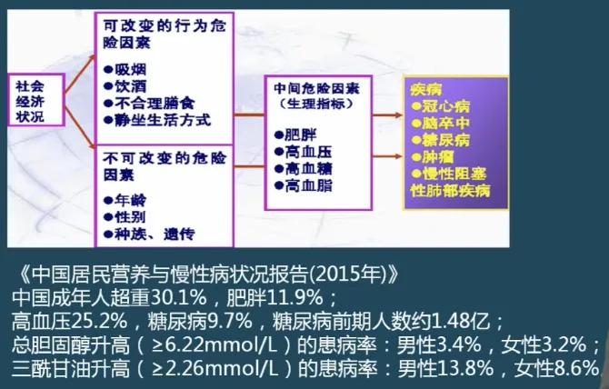
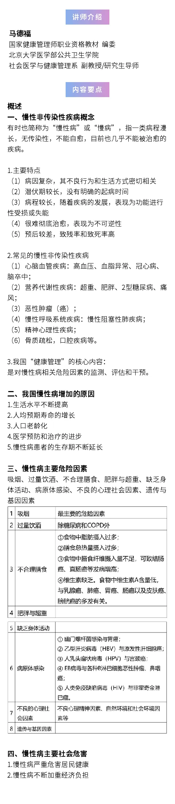

---
nav:
  title: 健康管理
  path: /healthy
  order: 8
toc: content
title: 4. 常见慢性病
description: 健康管理师课程笔记
keywords: [健康管理师, 健康管理]
group:
  title: 健康管理师
  order: 1
---

## 一、慢性非传染性疾病概念

### 慢性非传染性疾病的主要特点（重点）

1. 病因复杂，其不良行为和生活方式密切相关
2. 潜伏期较长，没有明确的起病时间
3. 病程较长，随着疾病的发展，表现为功能进行性受损或失能
4. 很难彻底治愈，看表现为不可逆性
5. 预后较差，致残率和致死率较高

### 常见的慢性非传染性疾病

1. 心脑血管疾病：高血压、血脂异常、冠心病、脑卒中
2. 营养代谢性疾病：超重、肥胖、2 型糖尿病，通风
3. 恶心肿瘤
4. 慢性呼吸系统疾病：慢性阻塞性肺病
5. 精神心理性疾病

### 重点

我国“健康管理”的核心内容：
是对慢性病相关危险因素的检测、评估和干预

### 我国慢性病增加的原因

慢性病负担的增加，除与生活水平不断提高，人均寿命的增长，以及人口老龄化有关外，还与医学预防和治疗的进步，慢性病患者的生产期不断延长

- 当一个国家或地区 60 岁以上老年人口占总人口数的 10%，或 65 以上老年人占人口总数的 7%

## 二、慢性病主要危险因素

一因多果，一果多因，多因多果，互为因果

### 常见慢性病与危险因素的内在关系

正常人-高危人群-疾病-并发症

- 慢性病致病的八大主要危险因素：
  - 吸烟
  - 过量饮酒
  - 不合理膳食
  - 过度肥胖
  - 缺乏身体活动
  - 病原体感染
    - 幽门螺旋杆菌
    - 乙肝
    - 人乳头瘤状病毒
  - 不良的心理社会因素
  - 遗传与基因因素

## 三、慢性病主要社会危害

- 慢性病严重危害居民健康
- 慢性病提高经济负担
- 慢病形势
  - 承认非传染性疾病给全球带来的负担和威胁是二十一世纪发展的主要挑战之一，有损世界各地的社会和经济发展，并威胁到国际商定发展目标的实现
  - 认识到非传染性疾病对许多会员国的经济是一个威胁，可能导致国家之间及人口之间的不平等加剧

