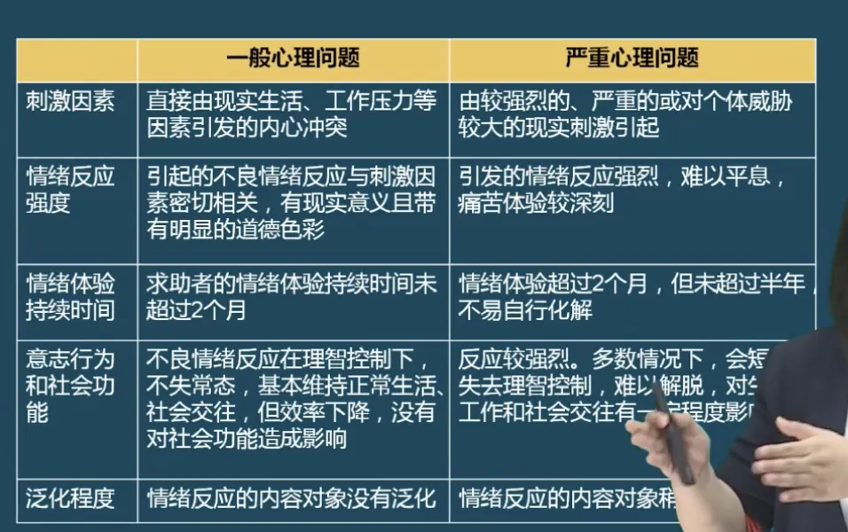
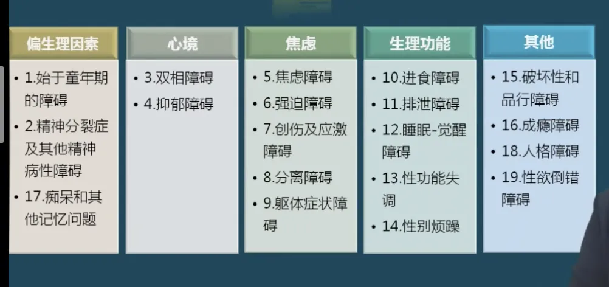
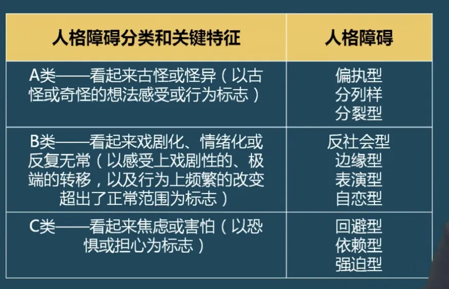
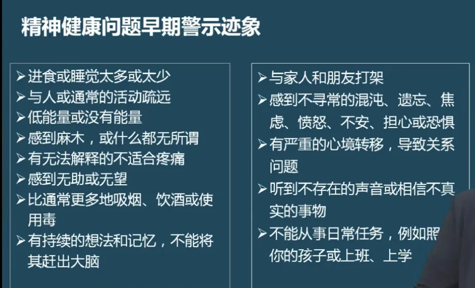
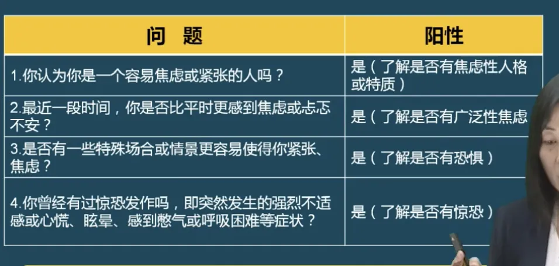
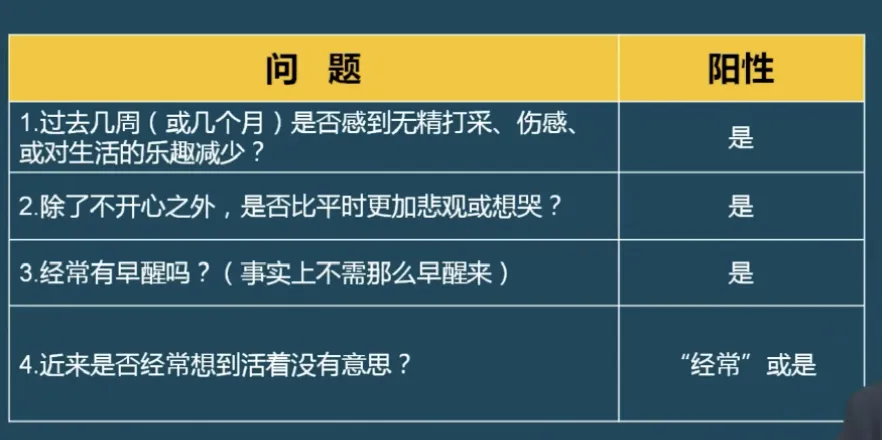
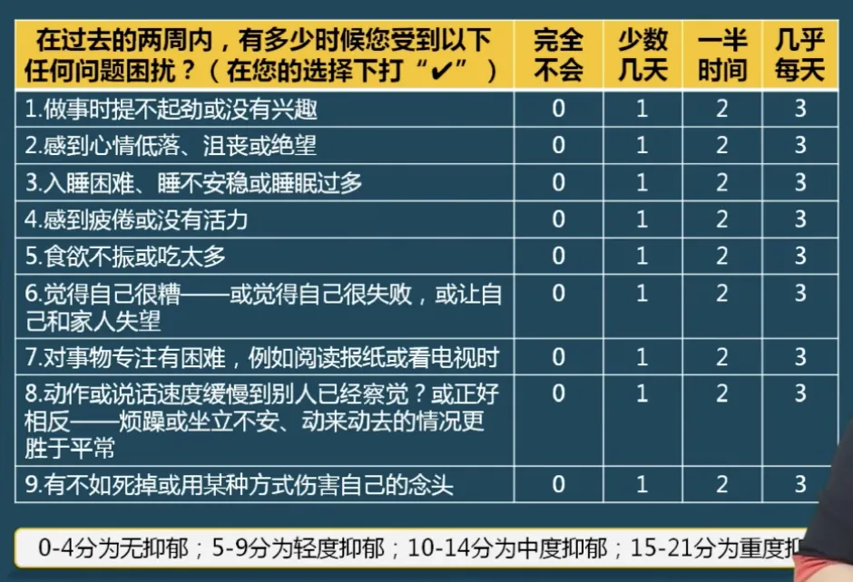

---
nav:
  title: 健康管理
  path: /healthy
  order: 8
toc: content
title: 9. 心理健康
description: 健康管理师课程笔记
keywords: [健康管理师, 健康管理]
group:
  title: 健康管理师
  order: 1
---

###

### 1. 一般/严重心理问题

### 2. 不良行为

表现形式：

1. 不良生活方式
2. 致病性行为模式
   1. A 型：外攻击型，容易较真，急性子，完美主义者，容易得和心脏相关的疾病。
   2. C 型：内攻击型，容易消沉，容易抑郁，从而引发自杀等。
3. 不良疾病行为：生病不看医生，迷信、占卜...等
4. 违规行为：违法行为

#### 网络成瘾主要特征

值慢性或者周期性对网络的生理和心理依恋的现象 ，包括：

1. 上网的欣快
2. 下网后的戒断反应
3. 难以抑制的上网行为

> 原理：让人快速达到快乐的状态，同时会存在进行中的欣快感和结束后的虚空感

## 第四节 常见心理障碍

### 1. 心理障碍的概念和类型

1. 每四个人中有一个人在生命中的某个时刻患有精神疾病
2. 精神疾病每年耗费美国和全世界数万亿美元
3. 但是很多人从未被诊断或治疗
4. 但是，精神疾病不是品格问题；它们是可以被治疗的
5. 然而，在它们的最早期，最可治疗的阶段，我们经常忽视或错过了这些疾病--直到它演变成为严重的、造成潜在生命威胁的状况。

#### 可导致精神疾病的主要生活应激

1. 亲密关系：失恋、分手、外遇、离婚、死亡
2. 主要生活变化：衰老、退休、毕业
3. 生活变化事件：婚姻、孩子诞生、孩子离家
4. 工作问题：新工作、失业、工作压力
5. 健康问题：慢性病、家属疾病

#### 常见心理障碍

#### 人格障碍分类和关键特征

### 2. 心理障碍的评估方法

注意：如若评估发现有发病迹象，应尽早劝病人就医，而不要给建议。

#### 焦虑状态的“90 秒 4 问题询问法”快速筛查(2 个)

#### 抑郁状态的“90 秒 4 问题询问法”快速筛查（四个都是）

#### 广泛性焦虑（7 项）自评筛查量表

#### 抑郁自评量表

## 第五节：心理健康的维护与促进

### 1. 心理健康的维护与促进

实施措施：

1. 树立社会主义的人生观与价值观
2. 保持与社会发展同步的生活节奏
3. 培养良好的心理素质于建全的人格
4. 规律生活，有效应对
5. 积极锻炼，合理兴趣
6. 自我觉察，善交朋友
7. 释放压力，定期放松

#### 健康的生活方式

1. 充分锻炼
2. 足够的睡眠
3. 健康饮食
4. 信赖朋友和相信家庭成员
5. 如何更好的应对生活压力

### 2. 特定人群心理健康的维护

#### 1. 儿童期心理健康维护的要点

1. 良好的家庭环境，温馨的亲子关系
2. 满足孩子独立的需要
3. 尊重孩子的自尊心
4. 为孩子树立良好的榜样
5. 正面教育为主，合理引导为辅
6. 学会交友，平等相处

#### 2. 青春期心理健康的维护要点

1. 培养兴趣，拓展潜力
2. 认识青春期，了解性知识
3. 学会控制情绪与行为
4. 培养独立意识，学会和睦相处
5. 尊重他人，增强自信
6. 提供青春期心理健康教育资源

> 注意：边缘系统还没发育好，容易冲动

#### 3. 壬辰期心理健康维护的要点

1. 认识妊娠期，了解胎儿保健知识
2. 学会控制情绪与行为
3. 培养兴趣，提高抵抗能力
4. 与他人交流，分享自身感受
5. 暗示作息，合理营养
6. 提供妊娠期心理健康教育资源

#### 4. 更年期心理健康维护的要点

1. 认识更年期，了解更年期保健知识
2. 学会控制情绪与行为
3. 培养兴趣，提高抵抗力
4. 鼓励交流，参与社交活动
5. 积极锻炼
6. 提供更年期心理健康教育资源

#### 5. 老年期心理健康维护的要点

1. 认识老年期，了解老年期保健知识
2. 培养兴趣，老有所成
3. 勤于锻炼，防治慢病
4. 积极劳作，科学健脑
5. 鼓励交流，参与社会活动
6. 提供老年期心理健康教育资源

> 注意：一定要和人交流，多劳作
