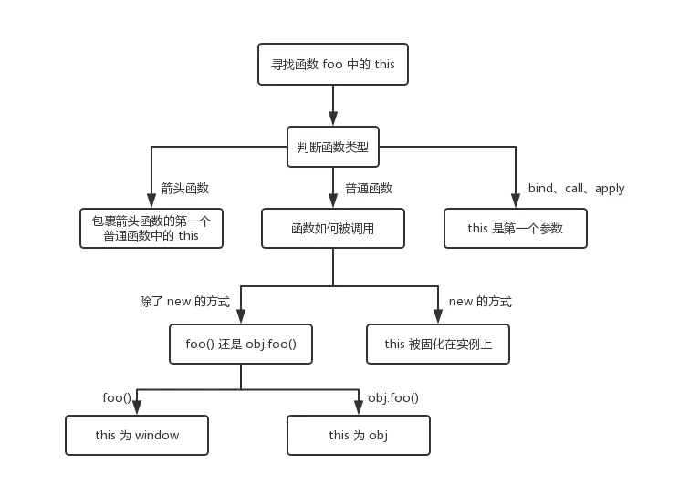
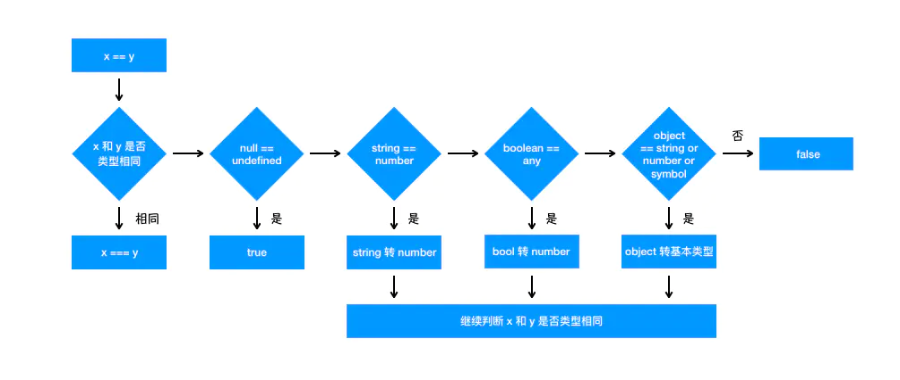
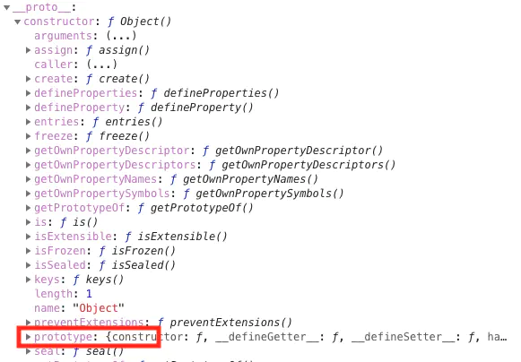

---
nav:
  title: 面试
  path: /interview
toc: content
title: JavaScript
group:
  title: 前端
  order: 3
---

## JavaScript

### `new` 操作符做了啥？

```html
创建一个空对象，并且this变量引用该对象，同时还继承了 该函数的原型
属性和方法被加入到this引用的对象中
新创建的对象由this所引用，并且最后隐式的返回this
```

### typeof 返回哪些数据类型

- object number function boolean undefined

> typeof null 返回的是 object，这个是个历史遗留问题

### typeof 和 instanceof 的区别？

1. typeof 返回的是数据类型，instanceof 返回的是布尔值
2. instanceof 可以判断复杂引用数据类型，但是不能判断基本数据类型
3. typeof 能判断基本数据类型，在引用类型中只能判断 function

> 通用检测数据类型，可以采用 Object.prototype.toString.call()，调用该方法，统一返回格式“[object Xxx]” 的字符串

### 3 种强制类型转换两种隐式类型转换

- parseInt parseFloat number
- == - ===

### 数组方法 pop() push() unshift() shift()

- push() 尾部添加 pop() 尾部删除
- unshift() 头部添加 shift() 头部删除

### ajax 请求 get 和 post 的区别

```text
post: 1. 传参不同，请求参数放在虚拟载体里面（data对象）、2. 如果服务器端不介入干预，大小没有限制。3. 参数不会暴露在链接上，所以安全性更强，并且post的内容不会被缓存。4. 传参类型不做限制。

get: 1. 参数在链接上。2、url链接长度有限制，所以大小有限制。3、传参在链接上，安全系数低。并且有缓存。4. 传参只能是ascll码类型

```

### bind、call 和 apply 的区别

共同点：都是为了改变 this 的指向而存在

不同点：

- call 可以接受多个参数：object.call(this, obj1,obj2,obj3)
- bind 可以接受多个参数：object.bind(this, obj1,obj2,obj3)
- apply 接受两个参数，一个是指向的对象，一个是需要传递的参数 object.apply(this, ${Array})
- call 和 apply 改变上下文 this 指向后，立刻执行该函数，而 bind 不执行

使用场景：如果参数数量不确定就用 apply，确定就用 call.

### ajax 请求时，如何解析 json 数据

- 使用 eval parse，介于安全性考虑 使用 parse 更靠谱
- eval 可以解析任何字符串，parse 只解析 json 格式的字符串

### 添加 删除 替换 插入到某个节点的方法

- obj.appendChild()
- obj.innersetBefore()
- obj.replaceChild()
- obj.removeChild()

### javascript 同源策略

- 一段脚本只能读取来自同一来源的穿考核文档的属性，同源：指主机名，协议和端口号的组合

### 编写一个 b 继承 a 的方法

```javascript
function A(name) {
  this.name = name;
  this.sayHello = function () {
    alert(this.name + 'say hello!');
  };
}

function B(name, id) {
  this.temp = A;
  this.temp(name);
  delete this.temp;
  this.id = id;
  this.checkId = function (ID) {
    alert(this.id == ID);
  };
}
```

### 如何阻止事件冒泡和默认事件

```javascript
function stopBubble(e) {
  if (e && e.stopPropagation) {
    e.stopPropgation();
  } else {
    window.event.cancelBubble = true;
  }
  return false;
}
```

### 谈谈 this 对象的理解

- this 只在调用的时候发生指向确认，它指向什么取决于在什么地方调用。this 指向的就是调用函数的那个对象。
- this 一般情况下： 是指全局对象 global， 如果作为方法调用，就指向这个对象
- 对于直接调用 foo 来说，不管 foo 函数被放在了什么地方，this 一定是 window
- 对于 obj.foo() 来说，我们只需要记住，谁调用了函数，谁就是 this，所以在这个场景下 foo 函数中的 this 就是 obj 对象(箭头函数则指向 window)
- 对于 new 的方式来说，this 被永远绑定在构造函数上面，不会被任何方式改变 this

```js
class Test {
  constructor() {
    console.log(this);
  }
}
export default () => {
  let demo = new Test();
};
```

### `location.replace()`与`location.assign()`区别

```html
location.replace() 的 url 不会出现在 history 中
```

### DOM 操作

```html
// 创建节点 createDocumentFragment() createElement() createTextNode() // 添加
移除 替换 插入 appendChild() removeChild() replaceChild() insertBefore() // 查找
getElementsByTagName() getElementsByName() getElementsByClassName()
getElementById() querySelector() querySelectorAll()
```

### JS 设置 css 样式的几种方式

```html
/* 1.直接设置style属性 */ element.style.height = '100px'; /* 2.直接设置属性 */
element.setAttribute('height', '100px'); /* 3.使用setAttribute设置style属性 */
element.setAttribute('style', 'height: 100px !important'); /*
4.使用setProperty设置属性，通过第三个参数设置important */
element.style.setProperty('height', '300px', 'important'); /* 5.设置cssText */
element.style.cssText += 'height: 100px !important';
```

### 阻止默认行为

```html
function stopDefault( e ) { // 阻止默认浏览器动作(W3C) if ( e &&
e.preventDefault ) { e.preventDefault(); } else { //
IE中阻止函数器默认动作的方式 window.event.returnValue = false; } return false; }
```

### 阻止冒泡

```html
function stopBubble(e) { // 如果提供了事件对象，则这是一个非IE浏览器 if ( e &&
e.stopPropagation ) { // 因此它支持W3C的stopPropagation()方法
e.stopPropagation(); } else { // 否则，我们需要使用IE的方式来取消事件冒泡
window.event.cancelBubble = true; } }
```

### Ajax 交互过程

```html
创建XMLHttpRequest对象,也就是创建一个异步调用对象.
创建一个新的HTTP请求,并指定该HTTP请求的方法、URL及验证信息.
设置响应HTTP请求状态变化的函数. 发送HTTP请求. 获取异步调用返回的数据.
使用JavaScript和DOM实现局部刷新.
```

### 考察知识点最广的 JS 面试题

[https://www.cnblogs.com/xxcanghai/p/5189353.html](https://www.cnblogs.com/xxcanghai/p/5189353.html)

```html
function Foo() { getName = function () { alert(1); } return this; } Foo.getName
= function () { alert(2); } Foo.prototype.getName = function () { alert(3); }
var getName = function () { alert(4); } function getName () { alert(5); } /*
写出输出 */ Foo.getName(); 3 getName(); 5 Foo().getName(); 3 getName(); new
Foo.getName(); new Foo().getName(); new new Foo().getName();
```

### splice 和 slice 你能说说有啥用和区别吗

1. splice：是可以实现数组的增删改查、只对数组生效，会改变原数组
2. slice：不光可以截取数组，也可以截取字符串，不会改变原数组

### 类数组和数组的区别

1. 类数组不具备数组的方法（slice、splice、filter）
2. 类数组是一个普通对象，数组类型是 Array

### JS 数组深浅拷贝

#### 浅拷贝

把一个对象的第一层拷贝到新的对象上去，只拷贝基本数据类型

```javascript
// slice 实现
var arr = ['old', 1, true, null, undefined];

var new_arr = arr.slice();

new_arr[0] = 'new';

console.log(arr); // ["old", 1, true, null, undefined]
console.log(new_arr); // ["new", 1, true, null, undefined]

// concat 实现
var arr = ['old', 1, true, null, undefined];

var new_arr = arr.concat();

new_arr[0] = 'new';

console.log(arr); // ["old", 1, true, null, undefined]
console.log(new_arr); // ["new", 1, true, null, undefined]
```

#### 深拷贝

拷贝所有类型的数据类型，不同的方法会有不同的克隆效果

```javascript
// 简单版：不能拷贝 函数、undefined、symbol 、循环引用的对象
var arr = ['old', 1, true, ['old1', 'old2'], { old: 1 }];

var new_arr = JSON.parse(JSON.stringify(arr));

new_arr[0] = 'new';
new_arr[3][0] = 'new1';

console.log(arr); // ["old", 1, true, ['old1', 'old2'], {old: 1}]
console.log(new_arr); // ["new", 1, true, ['new1', 'old2'], {old: 1}]

// 复杂版，可以完美拷贝
var deepCopy = function (obj) {
  if (typeof obj !== 'object') {
    return;
  }
  var newObj = obj instanceof Array ? [] : {};
  for (var key in obj) {
    if (obj.hasOwnProperty(key)) {
      newObj[key] =
        typeof obj[key] === 'object' ? deepCopy(obj[key]) : obj[key];
    }
  }
  return newObj;
};
```

### 数组去重

```javascript
// filter + indexOf
function unique(arr) {
  var res = arr.filter(function (item, index, array) {
    return array.indexOf(item) === index;
  });
  return res;
}

//filter + sort
function unique(arr) {
  return arr
    .concat()
    .sort()
    .filter(function (item, index, array) {
      return !index || item !== array[index - 1];
    });
}

// ES6
function uniqu3(arr) {
  return [...new Set(arr)];
}
```

###

### 找出数组中的最大值

```javascript
//	reduce
var arr = [6, 4, 1, 8, 2, 11, 3];

function max(prev, next) {
  return Math.max(prev, next);
}

console.log(arr.reduce(max));

//apply
var arr = [6, 4, 1, 8, 2, 11, 3];

console.log(Math.max.apply(null, arr));

//ES6
var arr = [6, 4, 1, 8, 2, 11, 3];

function max(arr) {
  return Math.max(...arr);
}

console.log(max(arr));
```

### 数组扁平化

```javascript
var arr = [1, [2, [3, 4]]];

function flatten(arr) {
  while (arr.some((item) => Array.isArray(item))) {
    arr = [].concat(...arr);
  }

  return arr;
}

console.log(flatten(arr));
```

### 数据的基本类型

```javascript
1. symbol 2. string 3. number 4. null 5. boolean 6. undefind
```

### 数据类型判断

> 关键语句：Object.prototype.toString.call(value) => [object ${Boolean Number String Function Array Date RegExp Object Error Null }]

```javascript
var class2type = {};

'Boolean Number String Function Array Date RegExp Object Error Null Undefined'
  .split(' ')
  .map((item, index) => {
    class2type['[object ' + item + ']'] = item.toLowerCase();
  });

function type(obj) {
  return typeof obj === 'object' || typeof obj === 'function'
    ? class2type[{}.toString.call(obj)] || 'object'
    : typeof obj;
}
```

### 防抖

原理：创建一个闭包，然后通过调用创建好的函数和入参去执行
应用场景是为了防止用户误触，而产生多次事件的触发，根本就是为了节省性能消耗

```javascript
/*
 * func：需要调用的函数
 * wait: 防抖时间
 * immediate：布尔值，是否立即执行
 **/

var debounce = function (func, wait, immediate) {
  var timeout;
  return function () {
    var context = this;
    var args = arguments;

    if (timeout) clearTimeout(timeout);

    if (immediate) {  // 是否立即执行func
      var callNow = !timeout;
      timeout = setTimeout(function () {
        timeout = null;
      }, wait)；

      if (callNow) {
        func.apply(context, args);
      }
    } else {
      timeout = setTimeout(function () {
        func.apply(context, args);
      }, wait);
    }
  }
}
```

## 节流

使用场景：把动作中的持续调用设置为固定时间内的调用，比如滚动事件，鼠标移入移出。

```js
const throttle = (fuc, delay) => {
  let time = null;

  return function () {
    const currentTime = new Date();

    if (currentTime - time > delay) {
      fuc.appy(this, arguments);
      time = currentTime;
    }
  };
};
```

### 四则运算符

- 运算中其中一方为字符串，那么就会把另一方也转换为字符串
- 如果一方不是字符串或者数字，那么会将它转换为数字或者字符串

#### 箭头函数

1. this 指向只取决于包裹箭头函数的第一个普通函数的 this
1. 无法改变箭头函数的指向



### ‘==’ 和 ‘===’ 有什么区别

== 对比类型不一样会进行类型转换，而 ’===‘ 不会，下图为 ’==‘ 的判断步骤：



### 什么是闭包？

定义：函数 A 中有一个函数 B，函数 B 可以访问 A 的变量，那么函数 B 就是闭包。

- 闭包就是引用其他函数内部变量的函数

1. 循环中使用闭包解决 `var` 定义函数的问题

```javascript
方法1
for (var i = 1; i <= 5; i++) {
  ;(function(j) {
    setTimeout(function timer() {
      console.log(j)
    }, j * 1000)
  })(i)
}

方法2：使用 setTimeout 的第二个参数
for (var i = 1; i <= 5; i++) {
  setTimeout(
    function timer(j) {
      console.log(j)
    },
    i * 1000,
    i
  )
}

方法3：使用 let
for (let i = 1; i <= 5; i++) {
  setTimeout(
    function timer(j) {
      console.log(j)
    },
    i * 1000,
    i
  )
}
```

2. react 自定义 hooks 也属于闭包

```js
const useCount  = ()  = {
  let count = 0

  const getCount = () => {
    return count
  }

  const setCount = (num: number) => {
    count = num
  }

  return {
    getCount,
    setCount
  }
}

```

3. 函数的柯里化

4. 回调函数

```js
const fn = (cb: (name: string) => void) => {
  let name = 'nicecode';
  cb(name);
};
```

### 如何理解原型？如何理解原型链？

原型的本质就是一个对象，我们创建一个构造函数的时候，它自动会带上一个 prototype 属性，这个属性就指向原型对象。它的作用就是用来提供基于函数原型继承的共享属性

当读取实例的属性获取不到时，如果找不到，就会查找与对象关联的原型中的属性，还找不到就会去找原型的原型，一直到顶层，这样的一层层的关系嵌套称为**原型链**

1. 每一个对象都有\***\*proto\*\***这是浏览器早期为了让我们能访问 prototype。
2. \_ \_proto\_\_  的 constructor（构造函数）里面有 prototype。
3. \_ \_proto\_\_  下面有几个方法：hasOwnProperty 、toString、toLocalString、valueOf、isPrototypeOf
4. 原型的  `constructor`  属性指向构造函数，构造函数又通过  `prototype`  属性指回原型，但是并不是所有函数都具有这个属性，`Function.prototype.bind()`  就没有这个属性。



## 理解 promise

promise 的出现是为了解决回调地狱（callback hell），它的其他 API 有：

1. all（处理所有 promise 事件回调的合集）

```js
let p1 = new Promise(function (resolve, reject) {
  resolve('ok1');
});
let p2 = new Promise(function (resolve, reject) {
  resolve('ok2');
});
let p3 = Promise.reject('err');

let res = Promise.all([p1, p2]).then((res) => console.log(res));
// ['ok1', 'ok2']

let res2 = Promise.all([p1, p2, p3])
  .then((res) => console.log(res))
  .catch((err) => console.error(err));
// err
```

2. race（获取最快的返回结果）

```js
let p1 = new Promise(function (resolve, reject) {
  setTimeout(() => resolve('ok1'), 500);
});
let p2 = new Promise(function (resolve, reject) {
  setTimeout(() => resolve('ok2'), 1500);
});

let res = Promise.race([p1, p2]).then((res) => console.log(res)); // ok1
```

3. allSettled（忽视 reject）

避免 promise 队列中有 reject 忽视。

### 手写一个 promise

```jsx
import React, { useEffect, useState } from 'react';

const PENDING = 'PENDING'; // 处理中
const FULFILLED = 'FULFILLED'; // 已完成
const REJECTED = 'REJECTED'; // 已拒绝

class Prom {
  constructor(executor) {
    // 默认状态为 PENDING
    this.status = PENDING;
    // 存放成功状态的值，默认为 undefined
    this.value = undefined;
    // 存放失败状态的值，默认为 undefined
    this.error = undefined;

    let resolve = (val) => {
      if (this.status === PENDING) {
        this.status = FULFILLED;
        this.value = val;
      }
    };

    let reject = (err) => {
      if (this.status === PENDING) {
        this.status = REJECTED;
        this.error = err;
      }
    };

    try {
      // 立即执行，将 resolve 和 reject 函数传给使用者
      executor(resolve, reject);
    } catch (error) {
      // 发生异常时执行失败逻辑
      reject(error);
    }
  }

  then(onFulfilled, onReject) {
    if (this.status === FULFILLED) {
      onFulfilled(this.value);
    }

    if (this.status === REJECTED) {
      onReject(this.reason);
    }
  }
}

export default () => {
  const [text, setText] = useState(PENDING);

  useEffect(() => {
    const promise = new Prom((resolve, reject) => {
      resolve('成功');
    }).then(
      (data) => {
        setText(data);
        console.log('手写promise', data);
      },
      (err) => {
        setText(err);
        console.log('faild', err);
      },
    );
  }, []);

  return <div>{text}</div>;
};
```

## async 和 await

基于 promise 的封装，如果对于不相互关联的 api 事件，则可以使用 promise.all

## 柯里化

特点：

1. 组合函数：可以将函数的逻辑简单化，并且达到更细粒度的代码拆分和复用
2. 延迟执行：可以延迟执行最后一个参数执行的时间，在期间做一些其他逻辑的执行，剩余的到后面再决定
3. 简单化函数：将参数从多参数拆为单参数，让接口简洁，更容易使用

```js
import React, { useEffect } from 'react';

function curry(a: number) {
  return function (b: number) {
    return function (offset: number) {
      return a + b + offset;
    };
  };
}

export default () => {
  curry(1)(2)(3);

  return <div>柯里化函数</div>;
};
```

## event loop 事件循环机制

js 执行的过程中，会创建对应的执行上下文放入栈中，我们称之为 **执行栈**，其中执行栈中的任务又会分为宏任务和微任务。按照流程执行就是一次宏任务的进行结束之后，查看是否有微任务，执行微任务，微任务执行完毕，再一次执行宏任务，就是所谓的 event loop

宏任务大概有：setTimeout()、setInterval()、setImmediate()、I/O、用户交互操作，UI 渲染

微任务则有：promise.then()、promise.catch()、new MutationObserver、process.nextTick()

```js
// 抽现转具象的描述事件循环
{
  tasks: [
    {
      script: '主代码块',
    },
    {
      script: 'innter的click回调函数',
      microtasks: [
        {
          script: 'Promise',
        },
        {
          script: 'MutationObserver',
        },
      ],
    },
    {
      script: 'outer的click回调函数',
      microtasks: [
        {
          script: 'Promise',
        },
        {
          script: 'MutationObserver',
        },
      ],
    },
    {
      script: 'setTimeout',
    },
    {
      script: 'setInterval',
    },
  ];
}
```

## 堆、栈的区别

1. 基本数据类型一般内存小，放在栈中；引用数据类型一般内存大，放在堆中
2. 栈的垃圾回收是执行环境结束立即释放，而堆需要所有引用结束才会释放
3. 一般来说栈的效率要高于堆

## v8 的垃圾回收机制

执行 js 的过程中，根据对象的存活时间进行不同的分代，然后根据不同的分代采用不同的回收算法

新生代的空间换时间 scavenge 算法是：1. 执行的过程中将空间分为 From 和 To 两块，2. 判断是否满足存活条件，存活的将变量复制到另一个空间，3. 不存活的直接清理。4. 将 From 和 To 空间交换，如此循环往复。

另外就是新生代的内存为 8M 左右，属于一个短期生命变量储存的区域，如果在执行新生代算法标记的过程中，发现某个变量多次出现，就会移交到老生代垃圾回收算法区

老生代的标记清除和整理，运行的时候将活跃的变量标记，并进行整理到内存的一端，移除那些不活跃的空间进行释放回收

## 十大错误

### 1. Uncaught TypeError: Cannot read property

发生这种情况的原因很多，但常见的一种是在渲染 UI 组件时对于状态的初始化操作不当。

### 2. TypeError: ‘undefined’ is not an object

这是在 Safari 中读取属性或调用未定义对象上的方法时发生的错误。这与 1 中提到的 Chrome 的错误基本相同，但 Safari 使用了不同的错误消息提示语。

### 3. TypeError: null is not an object

这是在 Safari 中读取属性或调用空对象上的方法时发生的错误。

> 在 JavaScript 中，null 和 undefined 是不一样的，这就是为什么我们看到两个不同的错误信息。undefined 通常是一个尚未分配的变量，而 null 表示该值为空。 要验证它们不相等，请尝试使用严格的相等运算符 ===

### 4. (unknown): Script error

当未捕获的 JavaScript 错误（通过 window.onerror 处理程序引发的错误，而不是捕获在 try-catch 中）被浏览器的跨域策略限制时，会产生这类的脚本错误。这是一种浏览器安全措施，旨在防止跨域传递数据，否则将不允许进行通信。

### 5. TypeError: Object doesn’t support property

这是您在调用未定义的方法时发生在 IE 中的错误。 您可以在 IE 开发者控制台中进行测试。

### 6. TypeError: ‘undefined’ is not a function

当您调用未定义的函数时，这是 Chrome 中产生的错误。

### 7. Uncaught RangeError: Maximum call stack

这是 Chrome 在一些情况下会发生的错误。 一个是当你调用一个不终止的递归函数。

### 8. TypeError: Cannot read property ‘length’

这是 Chrome 中发生的错误，因为读取未定义变量的长度属性。

### 9. Uncaught TypeError: Cannot set property

当我们尝试访问一个未定义的变量时，它总是返回 undefined，我们不能获取或设置任何未定义的属性。 在这种情况下，应用程序将抛出 “Uncaught TypeError: Cannot set property”。

### 10. ReferenceError: event is not defined

当您尝试访问未定义的变量或超出当前范围的变量时，会引发此错误。

## 参考文章

<https://github.com/CavsZhouyou/Front-End-Interview-Notebook>
