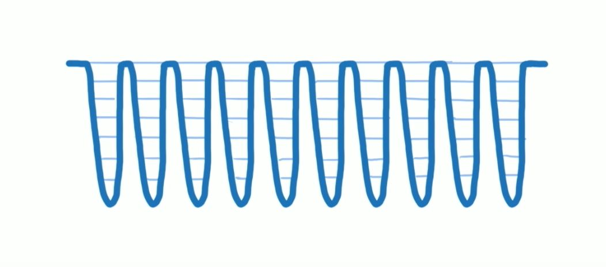
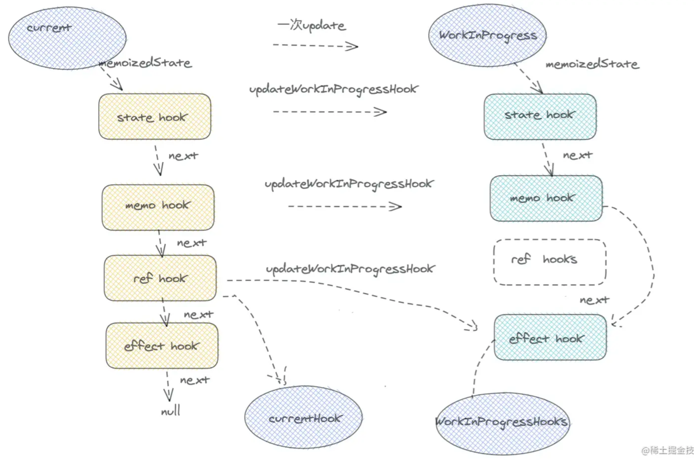

---
nav:
  title: 面试
  path: /interview
toc: content
title: React
group:
  title: 前端
  order: 8
---

# React

google 出品的一款前端 MVC 框架，将所有可视化模块组件化，提升开发效率，在前端界具有跨时代意义，目前居于三大框架之首。

## 为什么选择 react 框架，而不是原生 js

1. 复用率高：组件化的开发形式代码的复用率更高，交付更快，拓展性更强
2. 生态成熟：目前基于 react 的生态圈比较完善，可以更快提升开发的效率
3. 可读性强：相比较早年的 js + jq 的开发形式，MVC 结构能够更好的提升代码的易读性，让开发更加清晰

## 什么是 fiber 架构

react 需要经历两个阶段：

1. 将 jsx 转换成 AST 结构
2. 新老 AST 结构进行比较，让后更新渲染到页面上

16 以前的版本是将更新渲染直接入栈出栈队列执行，diff 算法本质上是一种递归，递归无法中断，这种形式可能会由于 IO 堵塞从而导致页面卡顿丢帧。
而 fiber 架构有效的改良了这一点，使用的是一种循环机制，将整个任务渲染切片成无数个小任务，发放到每个细分的时间节点中执行，优先处理最紧急的任务，有效降低了卡顿的情况发生。

另外我们需要了解人眼的视觉习惯，如下图所示



## hooks 组件 相比较传统 class 组件 的区别？

### 优点

1. 解决了 HOC 的嵌套问题，扁平式状态逻辑更加简洁
2. 解决了类组件的 this 指向问题
3. 分割在不同生命周期的代码使得代码难以维护
4. 降低代码的复用成本，减少每个组件继承 react.component,大大提升性能

### 缺点

1. 额外的学习成本
2. 没有类组件的生命周期，也就没办法和 ComponentUpdate 一样获取组件上的新旧数据做比较（性能优化上就少了一环）

## 为什么 hooks 要放在最外层

函数式组件他们由于新的 fiber 架构的关系，有自己的一套执行顺序，会形成一个自己的链表结构，也就是所谓的 mountWorkingProgress，stateHook -> memoHook -> refHook -> effectHook

如果将某个过程中的 hook 定义放在条件语句中，这个链表结构就会被破坏。



## memo 和 PureComponent

理论上父组件状态更新，但是传递给子组件的内容没更新，子组件不应该重新渲染，memo 和 PureComponent 都是为了减少父组件的刷新导致子组件的额外渲染，区别是 memo 针对的是函数组件，PureComponent 针对的则是类组件。

```js
class Component extends React.PureComponent {
  render() {
    return <div>类组件</div>;
  }
}

const Component = React.memo(() => {
  return <div>函数组件</div>;
});
```

## useMemo

将计算结果缓存下来，一般使用在比较复杂的计算函数中，降低大量计算的时候时间和性能上的消耗。

一般是如果一个引用数据，会在多个 hook 里被使用，或者是需要以 props 的形式传递给子组件，则需要包裹。

```jsx
import React, { useMemo, useEffect, useState } from 'react';

export default () => {
  const [data1, setData1] = useState(1);
  const [data2, setData2] = useState(1);

  const memo1 = useMemo(() => {
    console.log('执行memo');
    return data1;
  }, [data1]);

  const f2 = (() => {
    console.log('执行f2');
    return data2.toString();
  })();

  return (
    <div className="demo1">
      {memo1}
      <br />
      {f2}
      <button onClick={() => setData1(data1 + 1)}>f1按钮</button>
      <button onClick={() => setData2(data2 + 1)}>F2按钮</button>
    </div>
  );
};
```

## useEffect 和 useLayoutEffect 的区别

主要区别：

1. useEffect 是执行在编译和渲染之后，在第二个渲染周期才会执行，而且属于异步操作
2. useLayoutEffect 则是执行在编译之后和渲染之前，可以在渲染之前就立刻进行样式的更改

实际使用场景有 tooltip 通过宽度，判断展示位置应该处于上方还是下方
他们之间的差异如果用代码展示效果，可以从下面的代码来看出区别（建议使用差网络效果更明显）：

```jsx
import React, { useEffect, useLayoutEffect, useState, useRef } from 'react';

function BoxComparison() {
  const [heightEffect, setHeightEffect] = useState(0);
  const [heightLayoutEffect, setHeightLayoutEffect] = useState(0);
  const refEffect = useRef(null);
  const refLayoutEffect = useRef(null);

  useEffect(() => {
    if (refEffect.current) {
      setHeightEffect(refEffect.current.offsetWidth);
    }
  }, []);

  useLayoutEffect(() => {
    if (refLayoutEffect.current) {
      setHeightLayoutEffect(refLayoutEffect.current.offsetWidth);
    }
  }, []);

  return (
    <div>
      <div>
        <div
          ref={refEffect}
          style={{ width: '200px', height: '50px', background: 'lightgray' }}
        >
          使用 useEffect
        </div>
        <div
          style={{
            width: '100px',
            height: `${heightEffect}px`,
            background: 'red',
            marginTop: '10px',
          }}
        >
          红色方块
        </div>
      </div>
      <div style={{ marginTop: '30px' }}>
        <div
          ref={refLayoutEffect}
          style={{ width: '200px', height: '50px', background: 'lightgray' }}
        >
          使用 useLayoutEffect
        </div>
        <div
          style={{
            width: '100px',
            height: `${heightLayoutEffect}px`,
            background: 'blue',
            marginTop: '10px',
          }}
        >
          蓝色方块
        </div>
      </div>
    </div>
  );
}

export default BoxComparison;
```

## useCallback

基本上和 useMemo 代码逻辑是一样的，只是 useCallback 相比较 useMemo 是将函数缓存下来，防止执行其他操作的时候多次渲染，消耗性能。需要搭配 memo 一起使用。

使用原则也和 useMemo 保持一致

```jsx
import React, { useEffect, useCallback, useState } from 'react';

const Btn = React.memo((props) => {
  const [txt1, setTxt1] = useState(0);
  const [txt2, setTxt2] = useState(0);

  useEffect(() => {
    setTxt1(txt1 + 1);
  }, [props.fn1]);

  useEffect(() => {
    setTxt2(txt2 + 1);
  }, [props.fn2]);

  return (
    <div>
      使用了cb方法{txt1}
      <br />
      没使用cb方法{txt2}
      <button onClick={() => props.fn1()}>按钮1</button>
      <button onClick={() => props.fn2()}>按钮2</button>
    </div>
  );
});

export default () => {
  const [data1, setData1] = useState(1);

  const fn1 = useCallback(() => {
    console.log('使用了回调缓存');
    setData1(data1 + 1);
  }, []);

  const fn2 = () => {
    setData1(data1 + 1);
  };

  return (
    <div className="demo1">
      数据变化：{data1}
      <br />
      <button onClick={fn1}>父级按钮</button>
      <Btn fn1={fn1} fn2={fn2} />
    </div>
  );
};
```

## useContext 和 Provider

让开发者从多层嵌套中解脱出来，能实现跨层级数据共享

```jsx
import { createContext, useContext, useState } from 'react';

const ThemeContext = createContext(null);
const CurrentUserContext = createContext(null);

function Toolbar() {
  return (
    <div>
      <LoginButton />
    </div>
  );
}

function LoginButton() {
  const { currentUser, setCurrentUser } = useContext(CurrentUserContext);

  if (currentUser !== null) {
    return <p>You logged in as {currentUser.name}.</p>;
  }

  return (
    <Button
      onClick={() => {
        setCurrentUser({ name: 'Advika' });
      }}
    >
      Log in
    </Button>
  );
}

export default function MyApp() {
  const [theme, setTheme] = useState('light');
  const [currentUser, setCurrentUser] = useState(null);
  return (
    <ThemeContext.Provider value={theme}>
      <CurrentUserContext.Provider
        value={{
          currentUser,
          setCurrentUser,
        }}
      >
        <Toolbar />
        <button onClick={() => setTheme(theme === 'light' ? 'dark' : 'light')}>
          Toggle Theme
        </button>
      </CurrentUserContext.Provider>
    </ThemeContext.Provider>
  );
}
```

## useRef 和 forwardRef 的使用

useRef 的几个应用场景：

1. 可以用来获取 dom
2. 保存状态值，在不触发组件渲染的数据计算中使用
   forwardRef 是用来自己封装组件时，将组件的 ref 暴露出来

## lazy

懒加载组件，实现效果类似 webpack 的 code spliting。

```js
import React, { lazy, Suspense } from 'react';

const Comp = lazy(() => {
  return new Promise((resolve, reject) => {
    setTimeout(() => {
      resolve(import(/*webpackChunkName:"OtherComponent"*/ './OtherComponent'));
    }, 2000);
  });
});

export default () => {
  return (
    <div>
      <p>下面是一个动态加载的组件</p>
      <Suspense fallback="loading...">
        <Comp />
      </Suspense>
    </div>
  );
};
```

> 拓展：懒渲染可以参考 **react-visibility-observer** ，在页面滚动到可视范围时才加载相应的内容

## 列表使用 key 属性

首先我们需要知道 react 的 virtualDom 的原理，如果没有 id 作为标识的情况时，渲染引擎会直接将它视为新的标签，从而造成渲染的消耗，以下例子中，相比较添加了 key 属性来说，多了两次更新和一次新增的额外渲染。

```js
<ul>
  <li>Alen</li>
  <li>Bob</li>
</ul>

// 无key值
<ul>
  <li>Alen</li>
  <li>Bob</li>
  <li>Chris</li>
</ul>

// 有key值
<ul>
  <li>Alen</li>
  <li>Bob</li>
  <li>Chris</li>
</ul>
```

## componentDidMount 和 ComponentWillMount 区别

### componentWillMount

1. 将要装载，在 render 之前调用；
2. 可以在服务端被调用，也可以在浏览器端被调用；
3. componentWillMount 每一个组件 render 之前立即调用；
4. 目前在 17 中已经遗弃了这个接口，前缀为 UNSAFE\_

### componentDidMount

1. render 之后并不会立即调用，而是所有的子组件都 render 完之后才可以调用
2. 装载完成，在 render 之后调用
3. 只能在浏览器端被调用，在服务器端使用 react 的时候不会被调用

## 手写一个简单的 useState

```js
const [type, setType] = useState(1);

function useState(initData) {
  let type = initData;

  let setType = (val) => {
    type = val;
  };

  return [type, setType];
}
```

## redux 的工作原理

redux 分为几个重要的概念：1. store（容器）、2. state（数据）、3. action（动作）、4. reducer（计算动作过程）、5. dispatch（事件分发）

工作过程：dispatch 通过调用 action 执行一个事件，store 自动调用 reducer 对 state 进行变更，state 变更，同时 view 层也产生变化

## 参考文档

> https://juejin.cn/post/6844903922453200904 > <https://react.iamkasong.com/process/doubleBuffer.html#%E5%8F%8C%E7%BC%93%E5%AD%98fiber%E6%A0%91>
