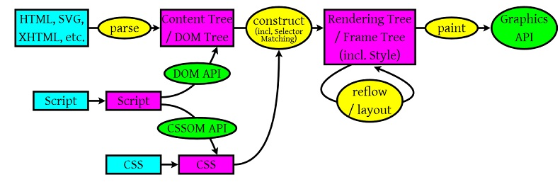

---
nav:
  title: 技巧
  path: /skill
  order: 5
toc: content
title: 计算机原理
group:
  title: 计算机原理
  order: 2
---

## 描述一下 cookies，sessionStorage 和 localStorage 的区别？

- cookie 在浏览器和服务器之间来回传递，SS 和 LS 不会
- SS 和 LS 的储存空间更大
- SS 和 LS 有更多丰富易用的接口
- SS 和 LS 是有各自的储存空间
- LS 储存是永久性的，SS 关闭浏览器就没了

## 如何实现浏览器内多个标签之间的通信

- 调用 LS Cookies 等本地储存方

## IE6 BUG 的解决办法

- 双边距，float 引起，使用 display
- 3 像素问题，float 引起， 使用 display：inline-3px
- 超链接 hover 点击失效， 注意顺序
- 无法定义 1px 左右的宽度容器（使用 overflow：hidden；zoom：0.08；line-height：1px）

## 你有哪些性能优化的方法

- 减少 http 请求次数，css，js，html 压缩，图片大小控制和压缩，网页 cdn 托管，data 缓存，图片服务器
- 前端模板 js + 数据，减少由于 html 导致的带宽浪费，减少请求次数，
- 图片预加载，将样式表放在头部，脚本放在底部，加上时间戳
- 用 innerHTML 代替 dom 操作，减少 dom 操作次数，优化 js 性能
- 当需要设置的样式很多时，设置 className 而不是直接操作 dom
- 按需加载三方库、如果是单页应用则按需加载路由页面
- 开启 gzip 模式
- 避免在页面的主体布局中使用 table，table 要在其中的内容完全下载完之后才会完全显示，显示 div+css 布局慢。普通网站有一个普遍的思路，就是尽量向前端化，减少数据库操作，减少磁盘 IO，
- 前端化：在不影响功能和体验的情况下，能在浏览器执行的不要在服务器执行，能在缓存服务器上直接返回的不要到应用服务器，程序能直接取到的结果不要到外部取，本机能取到的不要到远程取，内存能取到的不要到磁盘取，缓存中有的不要去数据库查询，多用 localstorage，sessionstorage、cookie
- 减少数据库操作指：减少更新次数，缓存结果减少查询次数，将数据库执行的操作尽可能的让你的操作完成，减少磁盘 IO 指尽量不适用文件系统作为缓存，减少读写文件次数等。
- 程序优化永远要优化慢的部分
- 图片加载使用懒加载、列表滚动使用虚拟滚动

## http 状态码有哪些？分别代表啥意思？

- 100-199 用于指定客户端相应的某些动作
- 200-299 用于表示请求成功
- 300-399 用于已经移动的文件并且常被包含在定位头信息中指定新的地址信息
- 400-499 用于指出客户端的错误。

> 400: 语义有误 401：当前请求需要用户验证 403: 服务器已经理解请求，但是拒绝执行他 404：页面找不到

- 500-599 用于支持服务器错误。501 服务器不可用

## http 缓存策略

分为强制缓存和协商缓存。

强制缓存分为三种情况：1. 没找到直接发起请求；2. 找到了但是缓存结果没有失效直接使用缓存；3. 找到了但是失效了就会去使用协商缓存

一般强制缓存的标识字段为 Expires（http1.0，指定过期时间） 和 Cache-control（http1.1, public/private/no-cache/no-store）,后者可以搭配 max-age 控制过期时间使用

协商缓存是强制缓存失效了，浏览器携带标识向服务端发起请求，服务器通过缓存标识决定是否使用缓存的过程。

协商缓存的字段为：last-modified / if-modified-since 和 Etag / if-none-match，后者优先级更高。

缓存的流程是请求报文向服务器发送 last-modified 或者 etag 字段，如果和服务端对应的字段一致，则服务端使用缓存返回 304，否则失效，重新请求 200

## 一个页面从输入 url 到页面显示完成，中间发生了什么？

- 查找浏览器缓存
- DNS 解析，查找该域名对应的 IP，重定向（301），这里如果做了 nginx 配置的话，会有一个负载均衡的发放，一般在有大型 IO 的项目会处理，发出第二个 get 请求
- 进行 HTTP 协议对话
- 客户端发送报头，我需要什么类型的文档
- 如果是 html 文档，开始下载
- 文档树建立，根据标记请求所需指定 mime 类型的文件
- 文件显示
- 浏览器这边做的工作大致分为以下几步：

> 加载：根据请求的 url 进行域名解析，向服务器发起请求，接受文件（html，js，css，图像等）
> 解析：对加载到的资源（html，js，css）进行语法解析，建议相应的内部数据结构（比如 html 的 dom 树，js 的属性表，css 的样式表规则等等）

## 浏览器的渲染原理

1）浏览器会解析三个东西：

- 一个是 HTML/SVG/XHTML，事实上，Webkit 有三个 C++的类对应这三类文档。解析这三种文件会产生一个 DOM Tree。
- CSS，解析 CSS 会产生 CSS 规则树。
- Javascript，脚本，主要是通过 DOM API 和 CSSOM API 来操作 DOM Tree 和 CSS Rule Tree.

2）解析完成后，浏览器引擎会通过 DOM Tree 和 CSS Rule Tree 来构造 Rendering Tree。注意：

- Rendering Tree 渲染树并不等同于 DOM 树，因为一些像 Header 或 display:none 的东西就没必要放在渲染树中了。
- CSS 的 Rule Tree 主要是为了完成匹配并把 CSS Rule 附加上 Rendering Tree 上的每个 Element。也就是 DOM 结点。也就是所谓的 Frame。
- 然后，计算每个 Frame（也就是每个 Element）的位置，这又叫 layout 和 reflow 过程。

3）最后通过调用操作系统 Native GUI 的 API 绘制。

## 并发（concurrency）和并行（parallelism）区别

异步和这小节的知识点其实并不是一个概念，但是这两个名词确实是很多人都常会混淆的知识点。其实混淆的原因可能只是两个名词在中文上的相似，在英文上来说完全是不同的单词。

并发是宏观概念，我分别有任务 A 和任务 B，在一段时间内通过任务间的切换完成了这两个任务，这种情况就可以称之为并发。

并行是微观概念，假设 CPU 中存在两个核心，那么我就可以同时完成任务 A、B。同时完成多个任务的情况就可以称之为并行。
